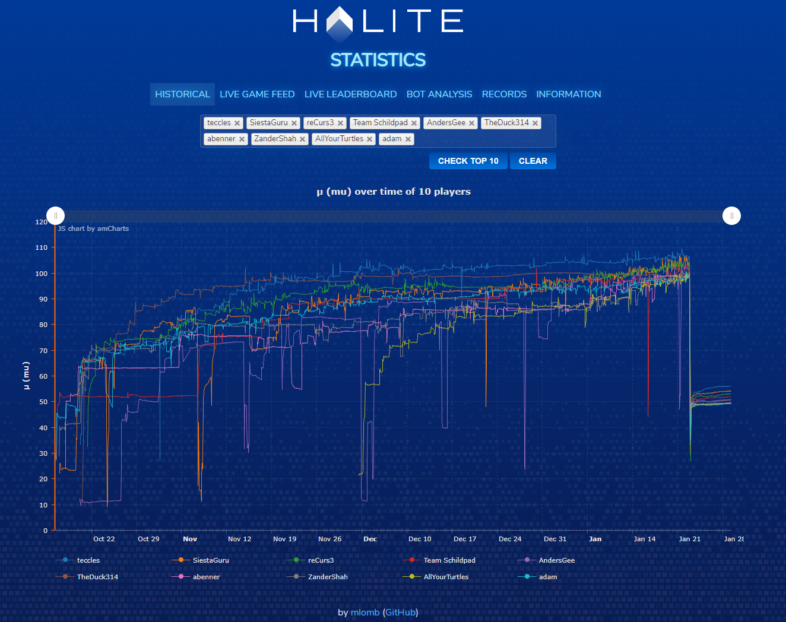

# Halite III Statistics & Analysis

⚠️ Disclaimer ⚠️: This site is a community website and is not affiliated with Halite or TwoSigma.

Link to the page: https://halite2018.mlomb.me (hopefully still up).

In this repo you will find the source code for the site. Take in mind this website was developed **during** the competition while I was also competing so don't expect quality code.

The public site can be found under `/web`.  
Crons will not work for obvious reasons.

## Database

You can download the full database in SQL format from Google Drive:

https://drive.google.com/file/d/1NPpk0du8i-8s3pU0jl7oBB_9-AjsNb7B

SQL file zipped: 831 MB, raw SQL file: 2.37 GB, in database: 4.46 GB.

### Tables

| Table       | Rows     | Size      |
|-------------|----------|-----------|
| games       | 4733588  | 666.9 MiB |
| games_users | 14152061 | 3.5 GiB   |
| historical  | 3909747  | 428.7 MiB |
| players     | 4018     | 1.7 MiB   |
| stats       | 1        | 16 KiB    |

## Post-mortems & Bot Source Code

Here is my [post mortem](https://mlomb.me/blog/halite-iii-postmortem) and [source code](https://github.com/mlomb/halite3-bot) for this competition.

You can find all post mortems and source codes here in [this post on the forums](https://forums.halite.io/t/collection-of-post-mortems-bot-source-code/1335.html). ([Archived post link](https://web.archive.org/web/20200207223822/https://forums.halite.io/t/collection-of-post-mortems-bot-source-code/1335.html))

## License

MIT